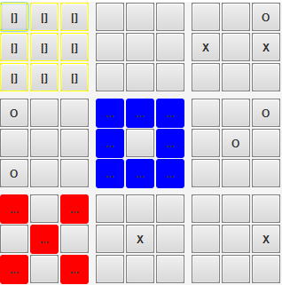

# Download

### GUI
User-friendly GUI: [KTTT-GUI](https://2-188856832-gh.circle-artifacts.com/0/home/circleci/repo/build/libs/kttt-gui-1.0.jar)  
The AI difficulty is hard-coded to 2000ms/4x for now. To adjust, build yourself. Future versions might use the main program (KTTT artifact) as ai backend.

### KTTT
The main program, with configurable settings (See usage below): [KTTT](https://2-188856832-gh.circle-artifacts.com/0/home/circleci/repo/build/libs/kttt-1.0.jar)

### Others
Let two different versions fight eachother: [AutoFighter](https://2-188856832-gh.circle-artifacts.com/0/home/circleci/repo/build/libs/auto_fighter-1.0.jar)

Selfplay (used for NN training): [Selfplay](https://2-188856832-gh.circle-artifacts.com/0/home/circleci/repo/build/libs/selfplay-1.0.jar)

[CircleCI-Link](https://circleci.com/gh/hilbigan/KTTT)

# Build

To build the GUI:
```
./gradlew jarGui
```
Edit ``src/main/kotlin/gui/MainGui`` to adjust AI strength.

To build KTTT (main AI):
```
./gradlew jarKTTT
```

To build AutoFighter (used to let two versions fight eachother):
```
./gradlew jarAutoFighter
```

To build Selfplay (lets agent fight itself and collects samples from the games for learning):
```
./gradlew jarSelfplay
```
# Run

To run the AI:
```
java -jar kttt*.jar [-h] [TIME] [THREADS] [--mcts] [--from-position FROM_POSITION]
                    [--movegen] [--movegen-depth MOVEGEN_DEPTH] [-r] [--persistent] [-p]
                    [-f MODEL_FILE] [-d]

// For more usage info
java -jar kttt*.jar -h
```
Available commands: 
- ``reset``: Reset board
- ``start``: Skip turn / let AI make first move
- ``draw``: Draw board (human-readable)
- ``exit``: Exit

To run AutoFighter:
```
java -jar auto_fighter*.jar <name0> "<command0>" <name1> "<command1>"
```
e.g.:
```
java -jar auto_fighter-1.0.jar 10 mcts "java -jar kttt-1.0.jar 100 4 --mcts --persistent -d" nn "java -jar kttt-1.0.jar 100 4 --nn --persistent -f ../../models/model.h5 -d"
```
